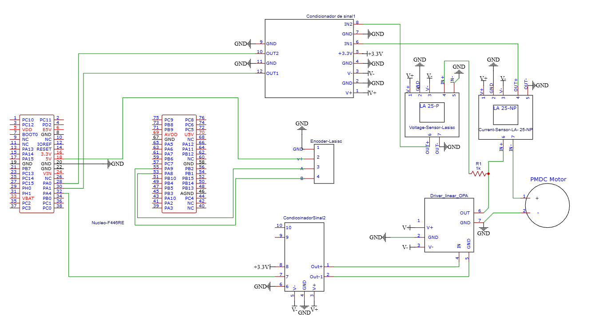

[EN](index.html)

# Gui Mendonça

Mestrando em **Engenharia Elétrica (Sistemas Dinâmicos & Controle)** na **USP São Carlos**.  
Atuo com **controle**, **identificação de sistemas**, **Visualização e Analise de Dados** e **ML** 

**Foco:** Controle & Automação • Embarcados/Mecatrônica • Dados/ML para sinais

## Projetos em destaque

### 1) Bancada PMDC + Identificação + Controle

Bancada experimental para caracterização de **motor CC**: instrumentação, aquisição de dados, estimação de parâmetros e projeto de controle (integral/realimentação e métodos robustos).
- **Palavras-chave:** STM32, sensores e condicionamento de sinal, MATLAB/Simulink, estimação de parâmetros, projeto de controle
- **Status:** repositório em montagem (vou publicar em breve)
- **Docs:** relatório de IC disponível

➡️ Repo: WIP
➡️ Relatório:  [Sicite 2023](https://seisicite.com.br/storage/seisicite-trabalhos-finais/453-6303670cb24b322bf76fbfb7a6cec866be482842cb37be814a3140d2e9f69c0d.pdf) [Sicite 2024](https://static.even3.com/anais/965321.pdf?v=639081521929843110)

---
## Links
- GitHub: https://github.com/GuiXbit
- LinkedIn: [Gui Linkedin](https://www.linkedin.com/in/gui-mendon%C3%A7a-78ba8a191/)

## Contato
- Email: mendoncagui2000@gmail.com
